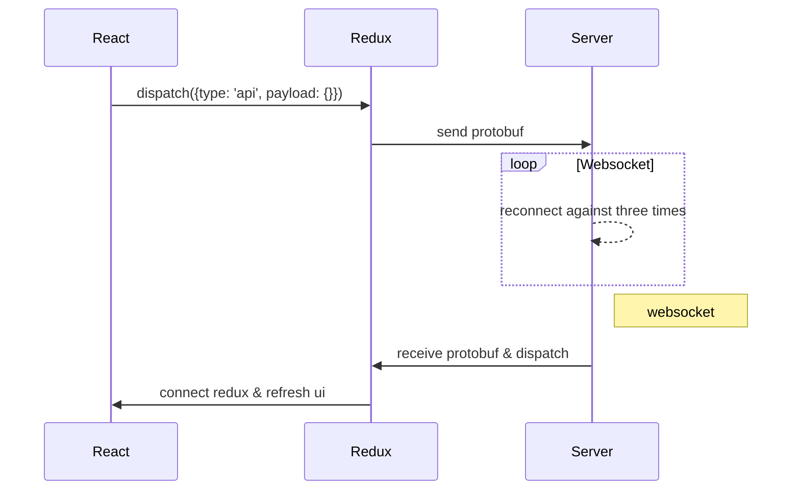

[toc]

### 系统框架



上面这个顺序图就是完整的消息总线，通过该总线可完成前端与后端的通信以及页面的刷新。

### React

项目中基本使用`函数组件`，其本质就是函数，没有 state 的概念的，因此不存在生命周期一说，仅仅是一个 render 函数而已。

但是引入 Hooks 之后就变得不同了，它能让组件在不使用 class 的情况下拥有 state，所以就有了生命周期的概念，所谓的生命周期其实就是 useState、 useEffect() 和 useLayoutEffect() 。

即：Hooks 组件（使用了Hooks的函数组件）有生命周期，而函数组件（未使用Hooks的函数组件）是没有生命周期的。

下面，是具体的 class 与 Hooks 的生命周期对应关系：

- `constructor`：函数组件不需要构造函数，我们可以通过调用 useState 来初始化 state。如果计算的代价比较昂贵，也可以传一个函数给 useState。

```js
const [num, UpdateNum] = useState(0)
```

- `getDerivedStateFromProps`：一般情况下，我们不需要使用它，我们可以在渲染过程中更新 state，以达到实现 getDerivedStateFromProps 的目的。

```js
function ScrollView({row}) {
const [isScrollingDown, setIsScrollingDown] = useState(false);
const [prevRow, setPrevRow] = useState(null);

if (row !== prevRow) {
    // Row 自上次渲染以来发生过改变。更新 isScrollingDown。
    setIsScrollingDown(prevRow !== null && row > prevRow);
    setPrevRow(row);
}

return `Scrolling down: ${isScrollingDown}`;
}
```

React 会立即退出第一次渲染并用更新后的 state 重新运行组件以避免耗费太多性能。

- `shouldComponentUpdate`：可以用 React.memo 包裹一个组件来对它的 props 进行浅比较

```js
const Button = React.memo((props) => {
// 具体的组件
});
```

注意：React.memo 等效于 PureComponent，它只浅比较 props。这里也可以使用 useMemo 优化每一个节点。

- `render`：这是函数组件体本身。

- `componentDidMount`, `componentDidUpdate`：useLayoutEffect 与它们两的调用阶段是一样的。但是，我们推荐你一开始先用 useEffect，只有当它出问题的时候再尝试使用 useLayoutEffect。useEffect 可以表达所有这些的组合。

```js
// componentDidMount
useEffect(()=>{
// 需要在 componentDidMount 执行的内容
}, [])

useEffect(() => {
// 在 componentDidMount，以及 count 更改时 componentDidUpdate 执行的内容
document.title = `You clicked ${count} times`;
return () => {
// 需要在 count 更改时 componentDidUpdate（先于 document.title = ... 执行，遵守先清理后更新）
// 以及 componentWillUnmount 执行的内容
} // 当函数中 Cleanup 函数会按照在代码中定义的顺序先后执行，与函数本身的特性无关
}, [count]); // 仅在 count 更改时更新
```

**请记得 React 会等待浏览器完成画面渲染之后才会延迟调用 useEffect，因此会使得额外操作很方便**

- `componentWillUnmount`：相当于 useEffect 里面返回的 `cleanup` 函数

```js
// componentDidMount/componentWillUnmount
useEffect(()=>{
// 需要在 componentDidMount 执行的内容
return function cleanup() {
// 需要在 componentWillUnmount 执行的内容
}
}, [])
```

- componentDidCatch and getDerivedStateFromError：目前还没有这些方法的 Hook 等价写法，但很快会加上。
为方便记忆，大致汇总成表格如下。


| class 组件 | Hooks 组件 |
| :---- | :---- |
| constructor |	useState |
| getDerivedStateFromProps | useState 里面 update 函数
| shouldComponentUpdate | useMemo |
| render | 函数本身 |
| componentDidMount | useEffect |
| componentDidUpdate | useEffect |
| componentWillUnmount | useEffect 里面返回的函数 |
| componentDidCatch | 无 |
| getDerivedStateFromError | 无 |

### Redux

通过useSelector、useDispatch等方法，我们可以用Hooks方法完成Redux的功能，Hooks和Redux之间没有替代关系，应该更好地共存和融合。

- `createStore`: 通过createStore将state存入store，
```js
const store = createStore(reducer, initialState);
```

再通过Provider向子组件暴露store，通过store在父子组件之间共享状态

 <Provider store={store}>
     <ChildComponentUseReactRedux />
 </Provider>

- `combineReducers`: 可将reducer拆分成多个子reducer
```js
const rootReducer = combineReducers({ reducer1, reducer2 })
```
可通过redux-devtool，看到根节点下面挂载着reducer1, reducer2子节点

- `useSelector`: 子组件可以通过useSelector访问name
```js
  const num = useSelector(state => state.num);
```
当然，也可以提出selector函数，方便替换和复用，如下
```js
const selector = state => {
  return state.num;
}

const num = useSelector(selector);
```

- `useDispatch`: 通过useDispatch 可以获取dispatch
```js
  const dispatch = useDispatch()
  dispatch({type: '/api', payload: { ... }})
```
即使多几个子组件也可以共享状态

```js
const ComponentUseReactRedux = () => {
  return (
    <div>
      <h2>ComponentUseRedux</h2>
      <Provider store={store}>
        <ChildComponentUseRedux1 />
        <ChildComponentUseRedux2 />
      </Provider>
    </div>
  )
}
```

### Protobuf

- [ProtocolBuffer](https://github.com/protocolbuffers/protobuf/releases), 下载对应版本，加入环境变量，在终端即可访问

- 添加proto文件：proto_person.proto，然后再终端对于目录下输入： protoc --js_out=import_style=commonjs,binary:. .\proto_person.proto 则会生成对应的文件：proto_person_pb.js
```js
syntax = "proto3";
package properson;

message Person {
  string Name = 1;
  int32 Age = 3;
}
```
- js中调用(序列化和反序列化接口的调用)
```
const pb = require('./proto_person_pb');

const p = new pb.Person();
p.setName("Tom");
p.setAge(18);

//序列化成二进制
const bytes = p.serializeBinary();

//反序列化二进制
const unBytes = pb.Person.deserializeBinary(bytes);

const name = p.getName();
const age = p.getAge();

console.log(bytes);
console.log(unBytes);
console.log("my name is ", name, "age is", age);
```

### Websocket

使用原生websocket，封装出send, receive, init, release, status这几个接口,代码比较少，不再赘述


### 目录结构
```
├─build //编译生成文件路径
│  └─static //不同类型的bundle文件
│      ├─css
│      ├─js
│      └─media
├─config    //编译配置dev & rel
├─public    //公用文件，一般无需改动
├─scripts   //node直接使用的，用于启动，调试，发布使用
└─src   //源代码
    ├─actions   //封装所有分发消息的逻辑接口，目前用的较少，逻辑操作简单，可废除
    ├─assets    //资源文件，根据不同类型进行划分文件夹
    ├─components//所有的组件
    │  ├─about  //关于(未使用)
    │  ├─attend //坐席(未使用)
    │  ├─center //图控中心 iframe进行加载
    │  ├─config //配置
    │  │  ├─attend  //坐席配置
    │  │  ├─device  //设备管理
    │  │  ├─expand  //设备扩展
    │  │  ├─mass    //集群配置（已废除）
    │  │  ├─network //网络配置
    │  │  ├─safe    //安全配置
    │  │  ├─screen  //大屏配置
    │  │  ├─system  //系统配置
    │  │  ├─unite   //级联配置
    │  │  └─users   //用户配置
    │  ├─maintain   //运维日志
    │  ├─matrix     //音频调度
    │  ├─navigation //整体布局，品字形布局
    │  ├─public //公用文件
    │  ├─route  //会控
    │  ├─screen //大屏调度
    │  │  ├─modal
    │  │  ├─public
    │  │  └─style
    │  └─status //未使用
    ├─config    //server配置
    ├─proto     //proto文件以及proto编译脚本
    ├─public    //未使用
    ├─reducers  // redux业务逻辑
    │  ├─config // 配置相关的redux逻辑
    │  ├─media-center   //会控的业务逻辑
    │  │  └─route
    │  └─schedule   //大屏调度的业务逻辑
    ├─routes
    ├─services  //graphql&ws的封装
    ├─styles    //样式
    └─utils     //工具集合
```